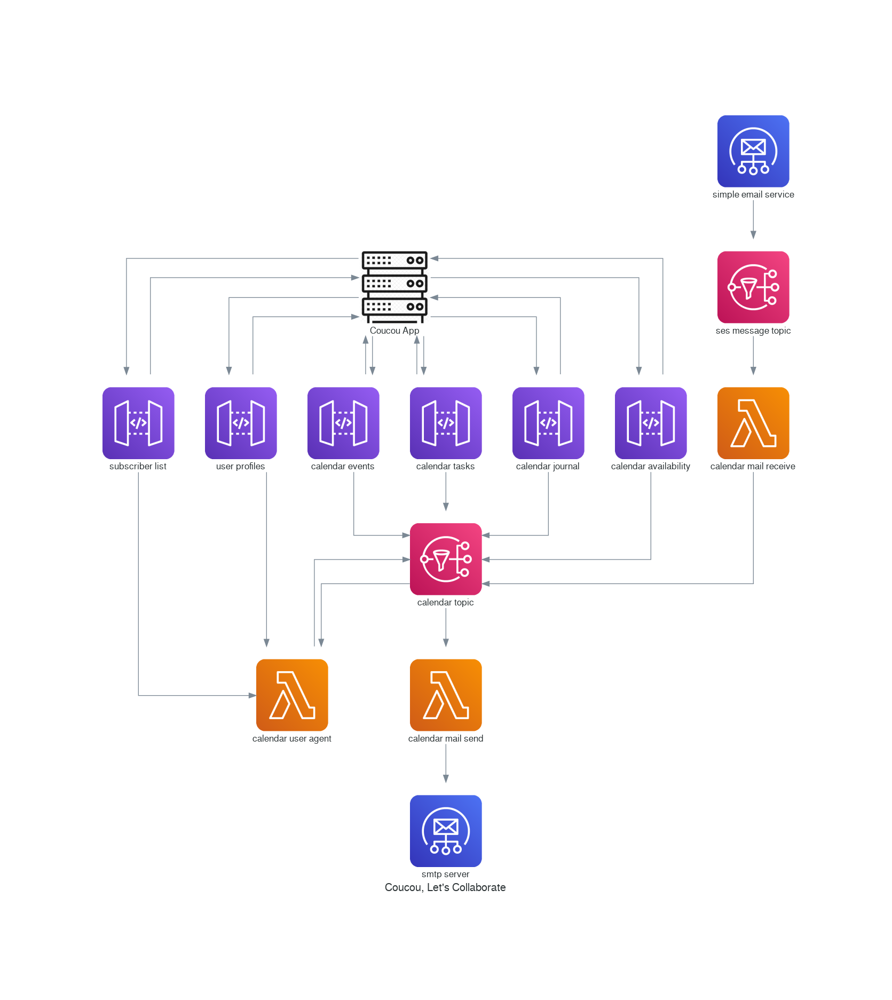

# Coucou! Let's Collaborate

[Introduction]: #introduction

[Features]: #features

[Getting started]: #getting-started
[Requirements]: #requirements
[Configuring]: #configuring

[Examples]: #examples

[Development]: #development

[Contributing]: #contributing

#### Table of Contents

1. [Introduction - What is Coucou?][Introduction]

## Introduction

Coucou is an Open Source group collaboration platform that is focused on moderated sharing of content and discussions.

Jots are posts that may be links to content, files or text-based notes.

Villages are moderated groups maintained by a Village Council. The Council is responsible for managing Village 
membership and moderating content associated with a Village.

A Conversation is a comment channel associated with a Jot in the context of a Village. Only Village members may
comment, and Conversations are only available when a Jot is approved for publication in a Village.

A village may be closed (private) such that only members (citizens) can see and participate in the shared content,
or they may be open (public) in that all users can view the content and (optionally) request membership.

Village membership is granted by invitation only, however public villages may provide the option to request membership.

All content shared by citizens remains under the control of the citizen and may be unshared at any time. If a citizen
leaves or is removed from a village all their shared content will be removed from the village. The only content not
removed are any conversations resulting from shared content.

Conversations are discussions in the context of a village based on a topic or shared content. Conversations serve the 
function of both comments on shared content and group chat.

A user may be a citizen of multiple villages in which they may collaborate and communicate with other citizens. Each
village profile (citizenship) allows customisation of visible attributes such as avatar (mascot), pseudonym, etc.
When a citizen posts or uploads content to a village it is stored in a dedicated user space to allow for 
user-controlled access management (e.g. unsharing, etc.).

## Glossary

 * **Jot** - a topic-based thread, analagous to a forum discussion, a ticket, an event, or anything that typically includes a thread of communication
 * **Village** - a community of Jotters as configured by a member (e.g. work, family, friends, hobbies, etc.)
 * **Citizen** - a village member
 * **Group** - a grouping of members
 * **Mascot** - an avatar/logo assigned to members, groups and villages
 * **Visibility** - public/private permissions applied to Jots, Villages, Groups
 * **Foo** - the mascot for Coucou Land
 * **Badge** - awarded to users for activity, by association (i.e. group membership), etc.
 * **Council** - a village council consists of trusted citizens that act as moderators for a village

## Platform Analogies

Coucou lends its concepts and model from a number of different sources, so it may be useful to describe these sources and their analagous counterparts.

| Coucou  | GitHub       | JIRA            | Mailing Lists | Forums    | Reddit               | Twitter      | Facebook
| ------  | ------       | ----            | ------------- | ------    | ------               | -------      | --------
| Village | Organization | Project         | List          | Group     | Sub-reddit           | -            | -
| Jot     | Repository   | Issue           | Thread        | Topic     | Topic                | Conversation | Messages
| Citizen | Team Member  | User            | Subscriber    | Member    | Member               | User         | User
| Council | Org. Owner   | Project Admin   | List Admin    | Moderator | Sub-reddit moderator | -            | -

## Anatomy of a URL

A coucou URL is primarily a pointer to a resource, be it a Jot, Citizen, Village, etc. A resource is identified by
a unique UID and a resource type:

    https://coucou.im/jot/20ea15fb4a4715222f7cf635247ef0e8
    
    https://coucou.im/citizen/801c07d82d0bce07de9c57fedd87a46f
    
    https://coucou.im/village/813f8ce580f276558ce9e5093468b1ab

A URL may be further decorated for ease of categorisation/recognition by humans:

    https://coucou.im/fortuna/jot/example-jot
    
    https://coucou.im/citizen/johnd
    
    https://coucou.im/village/carrot-village
